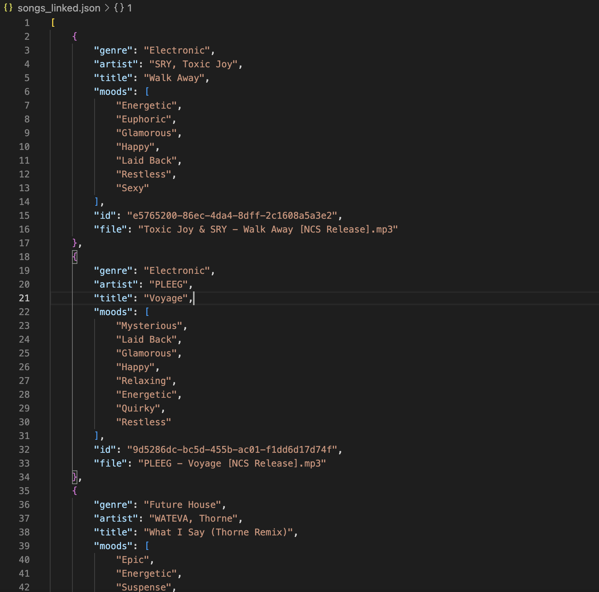

# NCSDownloader
A NodeJS and bash utility to download all songs from [NoCopyrightSounds](https://ncs.io/music). Also gathers metadata like genre and mood in JSON format.

**Disclaimer:** Use this software at your own risk. I am not responsible for any bans or blocks incurred by use of this software.

## Preview

## Instructions
1. Clone the repository and install npm packages: 

        git clone https://github.com/kirtan-shah/NCSDownloader
        npm install
2. Run node program to generate `download_list.txt` and `songs.json`:

        node index.js
3. Run download script `./download.sh` which contains the following:

        mkdir -p songs && xargs -n 1 -P 4 curl -OJs --output-dir songs < download_list.txt

4. Link file paths with objects in `song.json` (produces new file called `songs_linked.json`):
        python link_song_file.py

Note: The last page to scrape is currently hard coded at 66 in `index.js`, which may need to change with future song releases.